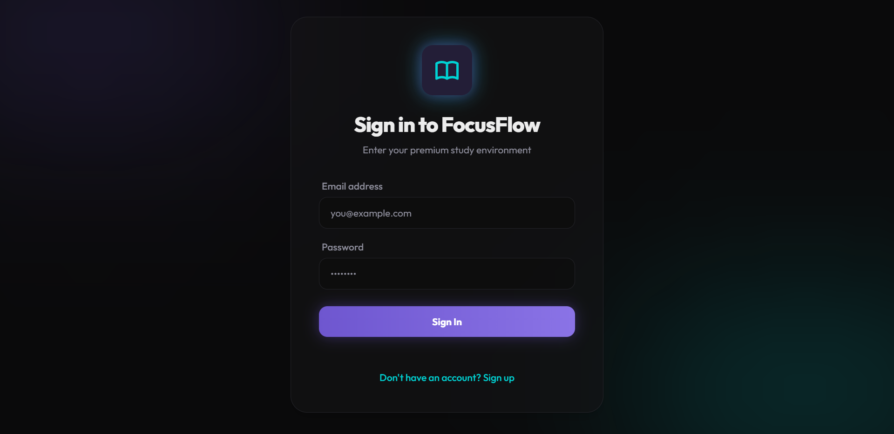
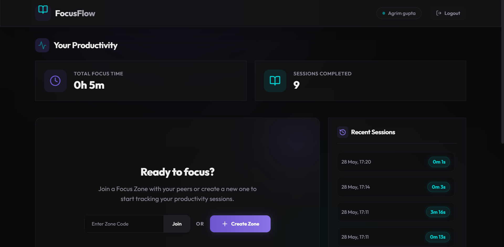
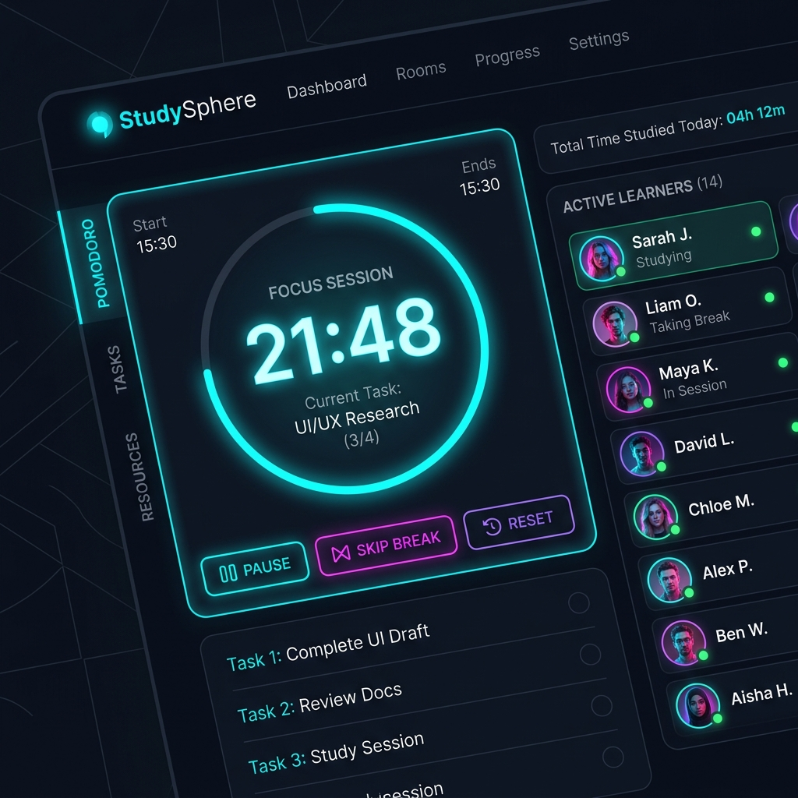
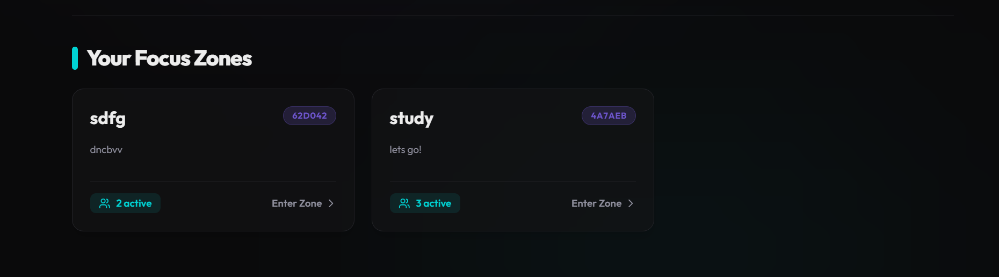

# Collaborative Study Room Platform

Staying consistent with study sessions can be difficult, especially when working alone. This project was built to address that challenge by creating a focused, distraction-free environment where users can study together in real time.

The Collaborative Study Room Platform allows users to create virtual study spaces, collaborate with others, and track their progress — helping recreate the experience of a real study group or library from anywhere.

---

## 🚀 Features Implemented

* **User Authentication**

  * Secure signup and login using JWT-based authentication
  * Protected routes and session handling

* **Study Room Management**

  * Create and join study rooms
  * View available rooms in real time

* **Real-time Chat**

  * Instant communication between participants
  * Powered by WebSockets for live updates

* **Session Timer**

  * Track study sessions using a built-in timer
  * Helps maintain focus and consistency

* **Activity Dashboard**

  * View past sessions and study activity
  * Track productivity over time

---

## 🛠️ Tech Stack

| Layer      | Technology                     |
| ---------- | ------------------------------ |
| Frontend   | React.js, Tailwind CSS         |
| Backend    | Java, Spring Boot              |
| Database   | MongoDB Atlas                  |
| Realtime   | WebSockets (STOMP)             |
| Deployment | (To be added after deployment) |

---

## ⚙️ Project Setup Instructions

### 🔧 Backend Setup

```bash
cd backend
./mvnw clean install
```

Create `.env` file:

```env
MONGODB_URI=your_mongodb_atlas_uri
JWT_SECRET=your_secret_key
```

Run backend:

```bash
./mvnw spring-boot:run
```

---

### 💻 Frontend Setup

```bash
cd frontend
npm install
```

Create `.env` file:

```env
VITE_API_URL=http://localhost:8080/api
```

Run frontend:

```bash
npm run dev
```

---

## 🔐 Environment Variables

### Backend (`backend/.env`)

```env
MONGODB_URI=your_mongodb_atlas_uri
JWT_SECRET=your_secret_key
```

### Frontend (`frontend/.env`)

```env
VITE_API_URL=http://localhost:8080/api
```

---

## 🌐 Deployment Steps

### Backend (Render / Railway)

* Connect GitHub repository
* Build Command:

  ```bash
  ./mvnw clean package -DskipTests
  ```
* Start Command:

  ```bash
  java -jar target/*.jar
  ```
* Add environment variables in dashboard

---

### Frontend (Vercel / Netlify)

* Connect frontend directory
* Build Command:

  ```bash
  npm run build
  ```
* Output Directory:

  ```bash
  dist
  ```
* Set environment variable:

  ```env
  VITE_API_URL=https://your-backend-url.com/api
  ```

---

### 🔗 Connecting Frontend & Backend

* Update backend CORS to allow deployed frontend URL
* Ensure frontend API URL matches deployed backend

---

## 📡 API Endpoints

| Method | Endpoint         | Description               |
| ------ | ---------------- | ------------------------- |
| POST   | /api/auth/signup | Register new user         |
| POST   | /api/auth/signin | Login and receive JWT     |
| GET    | /api/rooms       | Get all rooms             |
| POST   | /api/rooms       | Create new room           |
| GET    | /api/sessions    | Get study session history |

---

## 📸 Screenshots

### Login Page


### Dashboard


### Room Page


### Focus Zone


---

## 📌 Future Improvements

* Study streak tracking
* Notifications for session start/end
* Dark mode support
* Invite links for rooms

---

## 👤 Author

Built by **AGRIM GUPTA**
